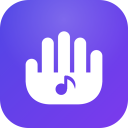
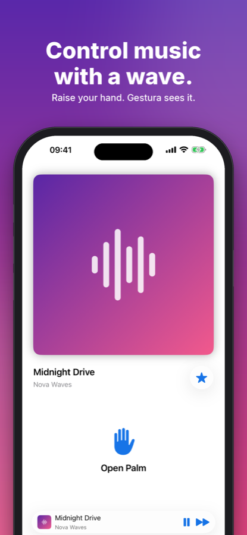
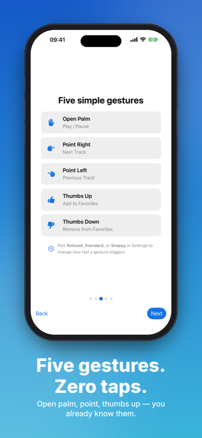
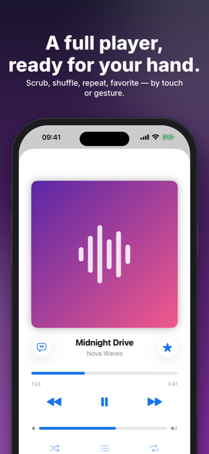
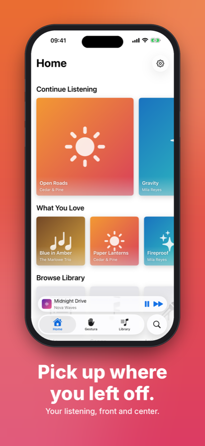
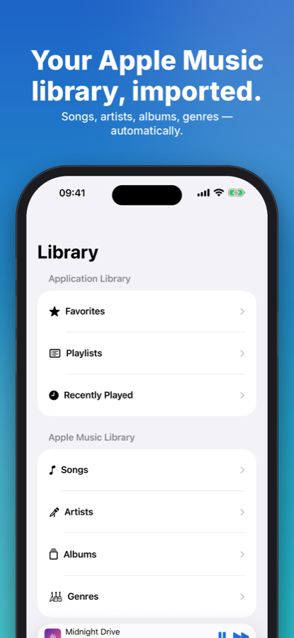
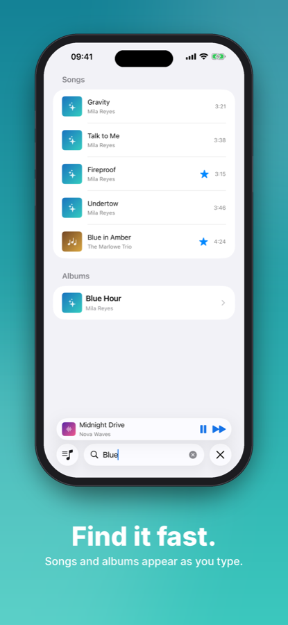
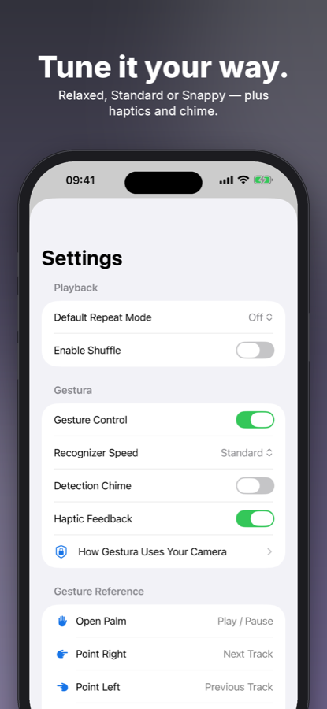
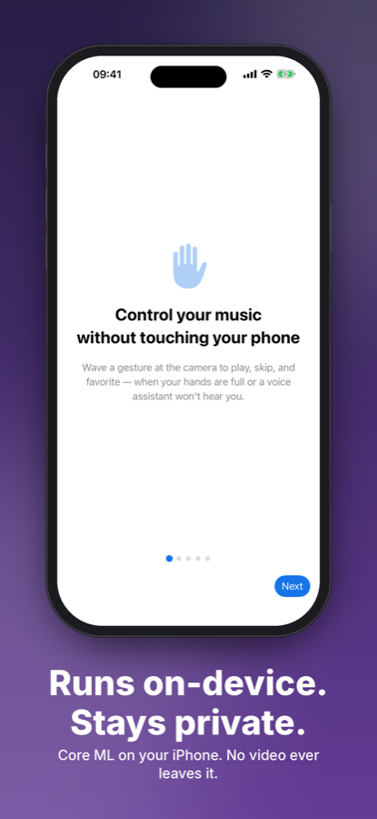

<div align="center">



# Gestura

**A hands-free iOS music player.** Control playback with hand gestures, recognized in
real time by an on-device CoreML model — no touch, no voice.

<a href="https://apps.apple.com/app/gestura-gesture-music-player/id6806563234">
  
</a> <br>


</div>

## Screenshots

| Gesture Control | Gesture Reference | Now Playing | Home |
|---|---|---|---|
|  |  |  |  |

| Library | Search | Settings | On-Device & Private |
|---|---|---|---|
|  |  |  |  |

> **Run on a real device.** Gesture control needs the front camera, and playback uses your on-device music library — neither works in the Simulator. Grant camera access when prompted, enable Gestura in Settings, and play a track.


<!-- Demo GIF: add the recording at assets/demo.gif, then uncomment.
## Demo

> A short screen recording of controlling playback with hand gestures.
-->

## What is Gestura?

Gestura is a full local-library music player for iPhone whose standout feature is **gesture control**: hold a hand pose in front of the camera and Gestura plays, pauses, skips, or favorites the current track — completely hands-free. It's built for the moments when your hands are busy or dirty (cooking, driving, working out) and reaching for the screen or talking to a voice assistant isn't practical.

## Gesture Vocabulary

| Gesture | Action |
|---|---|
| ✋ Open Palm | Play / Pause |
| 👉 Point Right | Next Track |
| 👈 Point Left | Previous Track |
| 👍 Thumbs Up | Add to Favorites |
| 👎 Thumbs Down | Remove from Favorites |

## How the Recognition Works

The pipeline is fully **on-device** and real-time:

```
Front camera (AVCaptureSession, video-only, ~12 fps)
   → Vision hand-pose detection (VNDetectHumanHandPoseRequest)
   → Custom CoreML hand-pose classifier (trained in Create ML — 99.6% test accuracy)
   → Confidence + hold-duration + cooldown filtering
   → PlaybackIntentDispatcher → MediaPlayer
```

- I **trained the classifier myself** in Create ML on ~5,000 self-labeled frames (99.6% test accuracy).
- Per-frame predictions are noisy, so recognition is stabilized with three filters: a **confidence threshold**, a **hold duration** (you briefly hold the pose), and a **per-gesture cooldown** (prevents double-firing).
- Frames are throttled to ~12 fps to keep CPU and battery reasonable.

### Sensitivity Presets
Users trade responsiveness against accidental triggers via three presets:

| Preset | Hold | Confidence | Cooldown |
|---|---|---|---|
| Relaxed | 0.70 s | 0.90 | 2.5 s |
| Standard | 0.45 s | 0.80 | 1.5 s |
| Snappy | 0.20 s | 0.70 | 0.8 s |

## Privacy by Design

- The camera feed is used **only** for on-device recognition — nothing is recorded, stored, or transmitted.
- The camera **stops the instant the app leaves the foreground** — that promise is enforced in code, not just stated.
- Graceful recovery states for camera-permission-denied and model-unavailable.

## Features

- 🎵 Full local music library — Home, Search, and Library (albums, artists, genres, songs, favorites, recently played)
- ▶️ Now Playing, mini-player, queue, and favorites
- ✋ Opt-in gesture control with a live recognizer view
- ⚙️ Recognizer sensitivity presets
- 🧭 One-time onboarding
- Haptic feedback and an on-screen feedback HUD

## Architecture

MVVM with a clean separation of concerns (~5,700 lines of Swift):

```
Models/       # Track, Gesture, PlaybackIntent, RecognizerSensitivity, ...
Views/        # SwiftUI screens (Home, Library, Player, Gesture, Onboarding, Settings)
ViewModels/   # PlayerViewModel, GestureViewModel, MusicLibrary
Services/     # GestureRecognitionService, PlaybackIntentDispatcher, MusicService, ...
Utilities/    # Artwork cache/loader, formatters, feedback HUD, ...
```

Key patterns:
- **Intent dispatch** — gestures (and UI actions) produce `PlaybackIntent`s routed through a single `PlaybackIntentDispatcher`, so hands-free control has one clean code path.
- **Swift Concurrency** — the recognizer streams detections through an `AsyncStream`; async/await throughout.
- **Reactive UI** — Combine + SwiftUI.

## Tech Stack

Swift · SwiftUI · CoreML · Vision · Create ML · AVFoundation · MediaPlayer · Combine · Swift Concurrency · MVVM

## Getting Started

```bash
git clone https://github.com/MohabAbdelatief/Gestura.git
open Gestura/Gestura.xcodeproj
```
## Requirements

- iOS 26.1+ · Xcode 26+
- An iPhone with songs in the Music library

Gestura plays your own library — songs added to Apple Music (including
downloads for offline listening) and audio already synced or purchased on the
device. It can't see or control Spotify, YouTube Music, or other streaming
apps, which keep playback inside their own processes.

## Support

- **[Support page](https://mohababdelatief.github.io/Gestura/support.html)** — setup, the gesture reference, and troubleshooting for missed or unwanted gestures.
- **[Privacy policy](https://mohababdelatief.github.io/Gestura/privacy.html)** — what the camera does and doesn't do.
- Bugs and feature requests: [open an issue](https://github.com/MohabAbdelatief/Gestura/issues) or email <mohababdelatief@icloud.com>.
